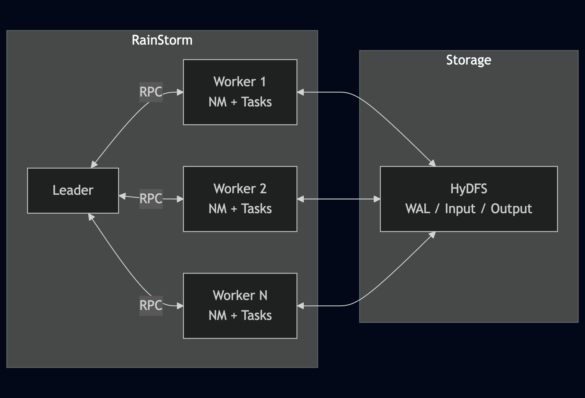
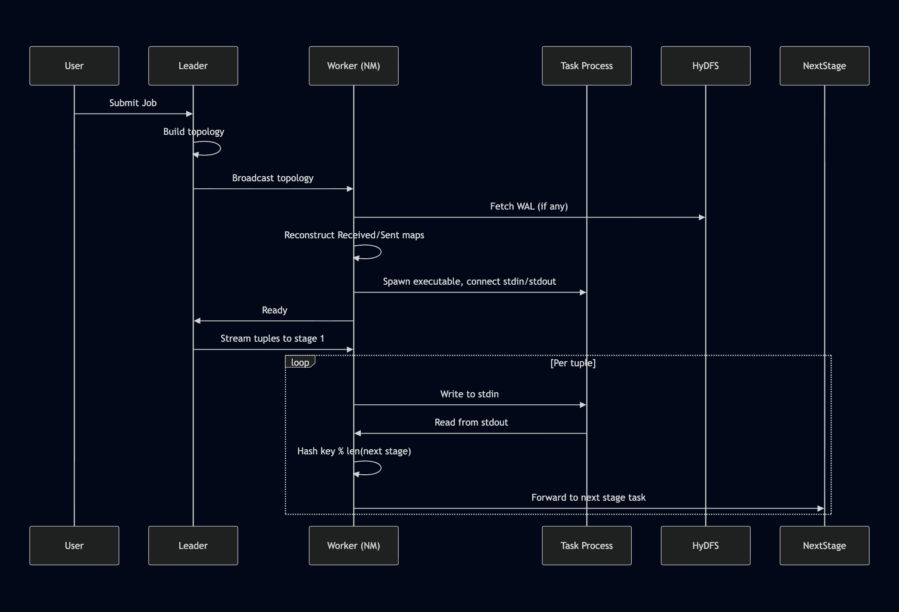
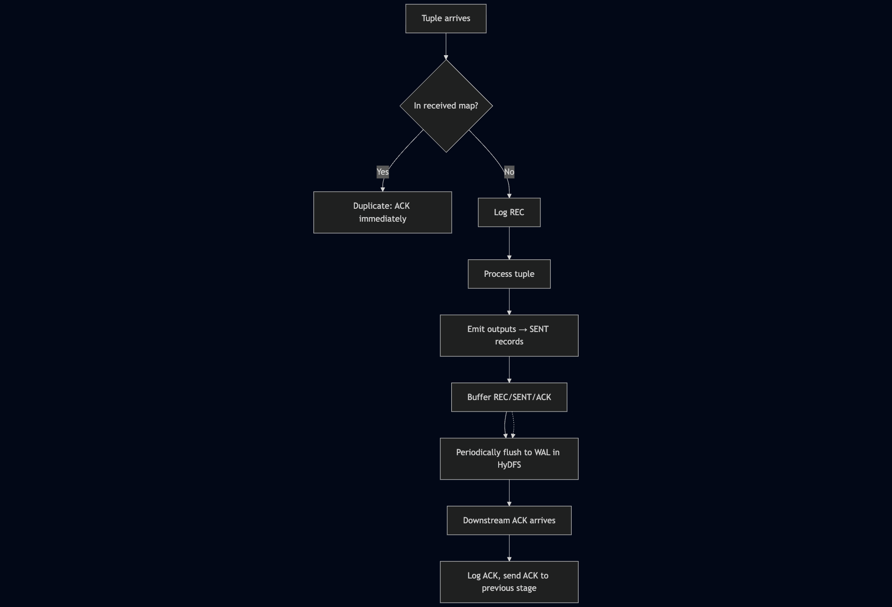
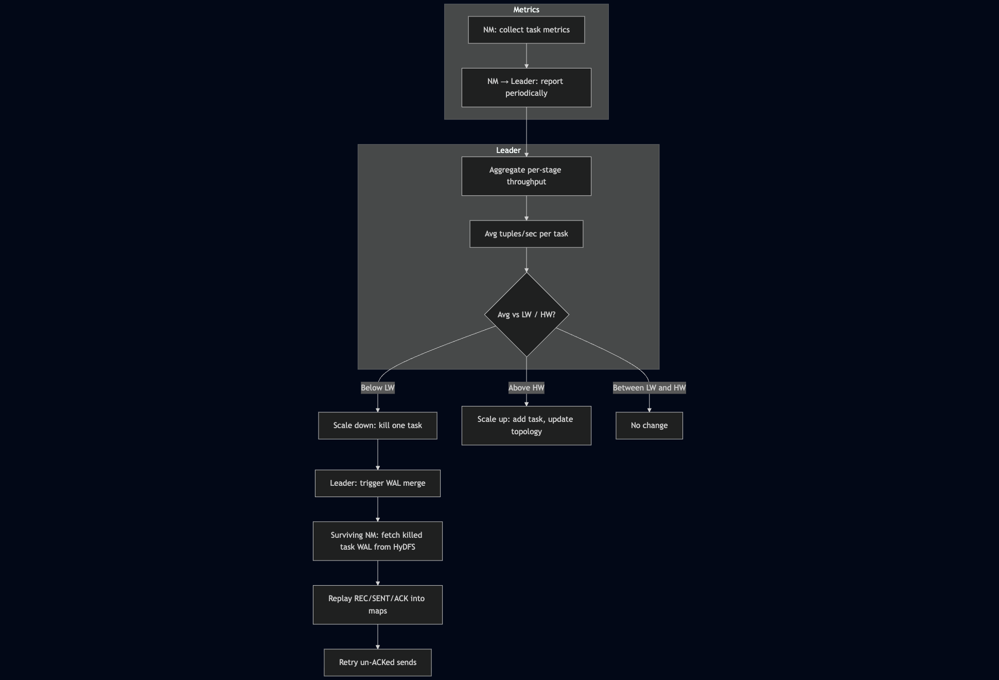

## RainStorm Distributed Stream Processing System

**RainStorm** is a distributed stream processing system built in Go on top of the HyDFS storage and membership substrate. It allows you to define multi-stage streaming jobs, where each stage runs a user-specified executable (e.g., `transform`, `filter`, `aggregate`) across a set of tasks distributed over multiple VMs.

---

### Design & Implementation

#### Architecture

RainStorm is implemented in **Golang** with a **leader–worker** model. Leader and worker nodes coordinate via **RPCs** to run streaming jobs that support **filters**, **transformations**, and **aggregations** on the incoming stream. The system provides **exactly-once semantics** (optional) to avoid duplicates under task failure and **autoscaling** to load-balance tasks based on stream rate.



#### Task Workflow

1. **Job submission & topology**  
   When a job is submitted, the leader builds the **topology**: list of stages, list of tasks, per-task node assignments, and each task’s input/output targets. This topology is **broadcast to all workers**.

2. **Worker initialization**  
   Each worker runs a **node-level manager (NM)** that, on receiving the topology, initializes the tasks on that node. For each task it:
   - Fetches **WAL logs** from HyDFS (if any),
   - Reconstructs the **Received** and **Sent** tuple maps (for exactly-once),
   - Runs the **task executable** as a separate process,
   - Connects **stdin** and **stdout** pipes to that process.

3. **Streaming**  
   Once all nodes have initialized their tasks, the leader starts streaming: it reads the input dataset and emits `<filename:linenumber, line>` tuples to **stage 1** tasks. When the NM receives a tuple, it:
   - Sends it to the correct task’s **stdin** pipe,
   - Reads output from that task’s **stdout** pipe,
   - Forwards each output tuple to the **next stage**.  
   Routing to the next stage is by **key hash**: `key % len(tasks in next stage)`.



#### Exactly-Once Semantics

When exactly-once is enabled, each task is paired with an **Exactly-Once Manager (EOM)** that tracks **received** and **sent** tuples.

- **Deduplication**  
  For every incoming tuple, the manager checks the received map. If the tuple ID is already present, it is treated as a **duplicate** and is **ACKed** back to the sender without processing.

- **Processing & logging**  
  For **new** inputs, the manager:
  - Logs a **REC** record,
  - Processes the tuple through the operation,
  - Records each emitted output as a **SENT** record in `sentTuples`,
  - Logs an **ACK** record when the downstream ACK arrives.  
  REC, SENT, and ACK records are buffered in memory and **periodically flushed** as JSON lines into a **per-task WAL** in **HyDFS**, so the state of in-flight and processed tuples is durably replicated.

- **ACK timing**  
  An ACK is sent back to the previous stage **only after** the tuple has been processed and logged to HyDFS.

- **Failure recovery**  
  If a node or task fails, the new instance **replays the WAL** to reconstruct the EOM (received + sent state). A **background retry loop** re-sends un-ACKed SENT tuples, optionally rerouting them using the current (possibly autoscaled) topology. When tasks are **scaled down**, their WALs are **merged** into surviving tasks so in-flight work continues without loss or duplication.



#### Autoscaling

- **Metrics**  
  The NM collects **metrics and status** for all tasks on its node and **periodically reports** them to the leader. The leader **aggregates** per-task metrics into **per-stage throughput** and computes the **average tuples per second per task** for each stage.

- **Thresholds**  
  Using configured **lower (LW)** and **upper (HW)** watermarks, the leader decides whether a stage is underutilized or overloaded:
  - If average throughput **below LW** → **scale down**: kill one task in that stage.
  - If average throughput **above HW** → **scale up**: add a new task instance on some node and update topology and assignments.

  This feedback loop runs continuously so the number of tasks per stage tracks the workload.

- **Scale-down and at-least-once**  
  To preserve **at-least-once** semantics during scale-down, the leader triggers a **WAL merge** on the node that hosts a surviving task in the same stage. The NM fetches the killed task’s WAL from HyDFS and replays REC, SENT, and ACK records into its in-memory maps. The surviving task can then **retry** any un-ACKed sends from the killed task, so in-flight tuples are not lost and are delivered at least once even as capacity is removed.



---

### Starting the System

From each VM, in the project root:

```bash
cd /Users/<user>/Desktop/uiuc_mcs/CS425/rainstorm

# Example: start on vm1, vm2, vm3 ...
go run . vm1
# in another terminal / VM
go run . vm2
# etc.
```


### CLI Commands (RainStorm-related)

From any node running the server binary, you can type commands into stdin. The most relevant for RainStorm are:

- **Submit a job**:

  ```bash
  RainStorm <Nstages> <Ntasks_per_stage> <op1_exe> <op2_exe> ... <opN_exe> \
           <hydfs_src_directory> <hydfs_dest_filename> \
           <exactly_once> <autoscale_enabled> <INPUT_RATE> <LW> <HW>
  ```

  - `Nstages`: number of processing stages.
  - `Ntasks_per_stage`: number of parallel tasks per stage.
  - `op*_exe`: per-stage operation spec, described below.
  - `hydfs_src_directory`: HyDFS directory containing input files.
  - `hydfs_dest_filename`: HyDFS output file produced by the final stage.
  - `exactly_once`: `true`/`false`.
  - `autoscale_enabled`: `true`/`false`.
  - `INPUT_RATE`: target input rate (tuples/sec).
  - `LW`, `HW`: lower/upper watermarks for autoscaling.

- **Inspect topology / rates**:

  ```bash
  print_topology     # show stages, tasks, and assigned VMs
  print_stage_rates  # show per-stage input throughput
  list_tasks         # list all tasks and their status
  ```

All HyDFS and membership-related commands (`create`, `get`, `append`, `multiappend`, `ls`, `liststore`, etc.) are unchanged from the original system (see `README_old.md`).

### RainStorm Examples

```bash
RainStorm 2 3 ./task_executable/filter/filter:: ./task_executable/aggregate/aggregate::7 ./hydfs/input/dataset1.csv output.txt true false 100 30 40
```

```bash
RainStorm 2 3 "./task_executable/filter/filter::JANEY DR" ./task_executable/aggregate/aggregate::3 ./hydfs/input/dataset3.csv dataset2_output.txt true false 100 40 50
```

### HyDFS and Membership CLI Commands

All underlying HyDFS and membership commands are the same as in the original system:

- **`list_self`**: print this node’s membership identifier.
- **`list_mem_ids`**: show the current membership list with hashes and status.
- **`display_protocol`**: report the active `{protocol, suspicion}` pair and drop rate.
- **`switch {gossip|ping} {suspect|nosuspect}`**: change the membership protocol and suspicion mode and broadcast to peers.
- **`display_suspects`**: list nodes currently marked as suspects.
- **`drop <percentage>`**: inject simulated message loss (e.g., `drop 0.2` for 20%).
- **`leave`**: issue a voluntary leave announcement.
- **`create <local> <HyDFS>`**: upload a local file into HyDFS.
- **`get <HyDFS> <local>`**: download a HyDFS file into the local directory.
- **`append <local> <HyDFS>`**: append data from a local file to a HyDFS file.
- **`merge <HyDFS>`**: trigger metadata/file reconciliation for the named file.
- **`multiappend <HyDFS> <vm...> <local...>`**: orchestrate parallel appends from multiple VMs.
- **`printmeta <HyDFS>`**: display stored metadata (including append order) for a file.
- **`ls <HyDFS>`**: list replicas that currently store the file.
- **`liststore`**: enumerate all files stored on this VM along with their IDs.
- **`getfromreplica <vm> <HyDFS> <local>`**: fetch a replica directly from a specific VM.
