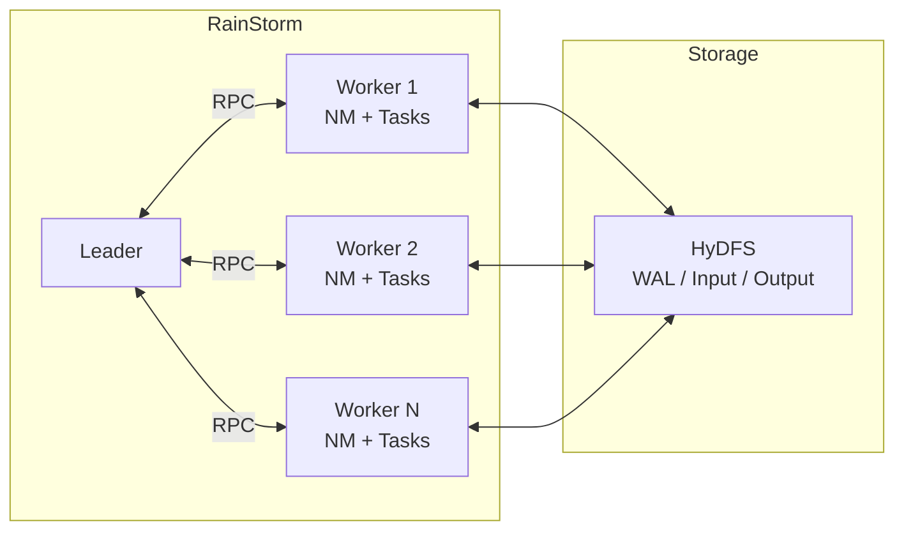
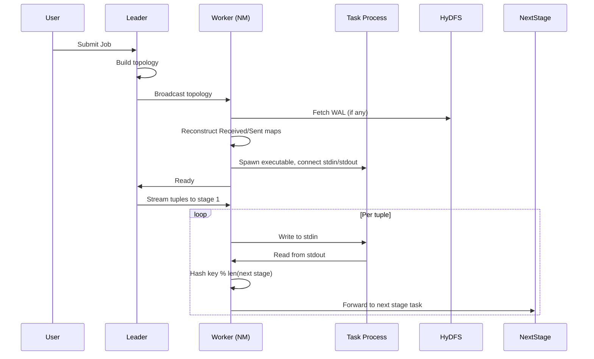
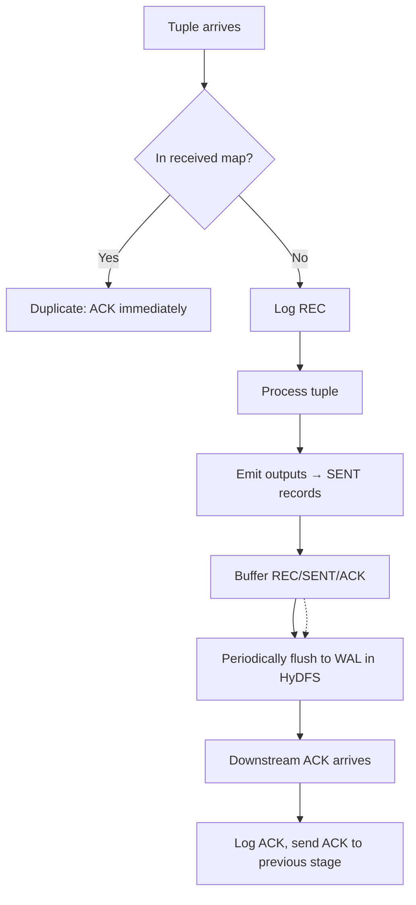
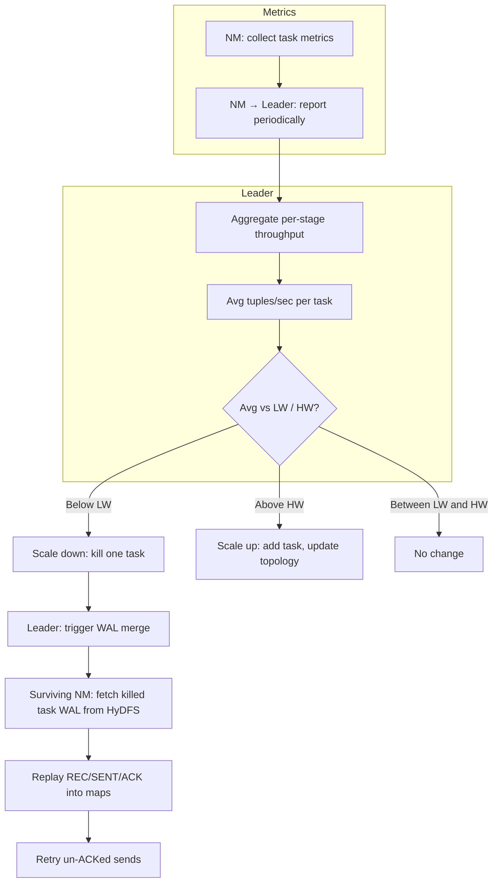

# RainStorm flow diagrams

Generate a PNG from each Mermaid block below and save as the filename indicated. Use these PNGs in the main README.

---

## 1. Architecture → `architecture.png`

---

## 2. Task Workflow → `task-workflow.png`

---

## 3. Exactly-Once Semantics → `exactly-once.png`

---

## 4. Autoscaling → `autoscaling.png`

